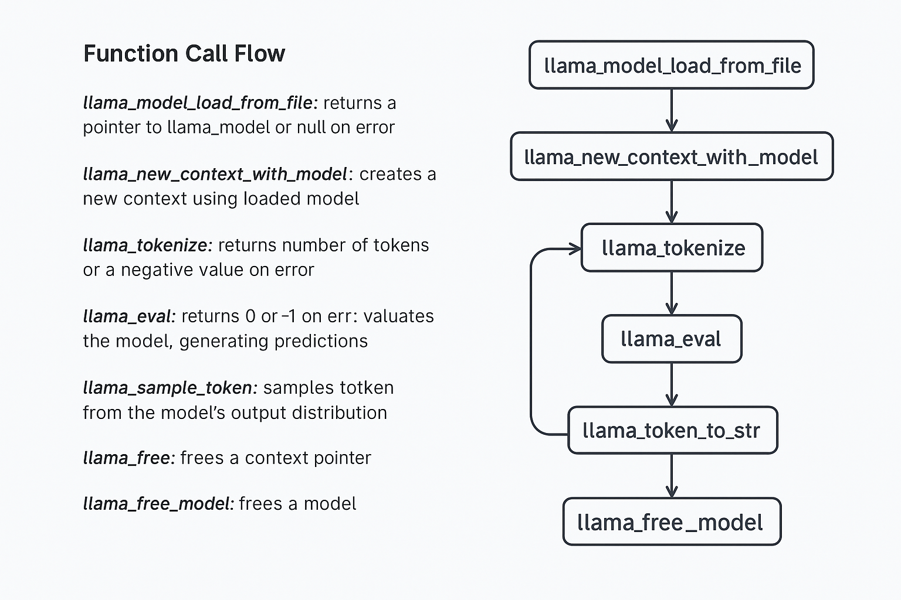

# 🧠 LLaMA.cpp Function Flow Guide

This guide documents how the `llama.cpp` library works for inference and text generation using GGUF models.

---

## 📊 Flow Diagram

---

## 🔍 Detailed Function Descriptions

This document explains, step-by-step, how each core llama.cpp function works — what inputs it takes, what it does internally, and what output it gives — as you generate text with a GGUF model.

---

### 1. `llama_backend_init()`
- **Input:** None  
- **Output:** void  
- **Description:** Initializes the backend (e.g., registers CPU/GPU). Call this before loading any model.

---

### 2. `llama_model_load_from_file(path, model_params)`
- **Input:**  
  - `path`: path to `.gguf` model  
  - `model_params`: model loading settings  
- **Output:** `llama_model*`  
- **Description:** Loads and parses GGUF file, reads tensor data into memory.

---

### 3. `llama_context_default_params()`
- **Input:** None  
- **Output:** struct `llama_context_params`  
- **Description:** Returns default context configuration.

---

### 4. `llama_new_context_with_model(model, ctx_params)`
- **Input:**  
  - `model`: pointer from `load_from_file()`  
  - `ctx_params`: structure from above  
- **Output:** `llama_context*`  
- **Description:** Creates context that tracks memory, tokens, KV cache, etc.

---

### 5. `llama_model_get_vocab(model)`
- **Input:** `llama_model*`  
- **Output:** `const llama_vocab*`  
- **Description:** Gets the vocabulary/tokenizer info for tokenizing and decoding.

---

### 6. `llama_tokenize(vocab, text, text_len, tokens[], max_tokens, add_bos, parse_special)`
- **Input:** string, length, tokenizer pointer  
- **Output:** number of tokens written  
- **Description:** Converts input string into token IDs using the model tokenizer.

---

### 7. `llama_batch_get_one(...)`
- **Description:** Creates a token batch used for inference  
- **Output:** `llama_batch`

---

### 8. `llama_decode(ctx, batch)`
- **Input:** context and token batch  
- **Output:** 0 = success, -1 = error  
- **Description:** Feeds tokens into the model and updates the internal state

---

### 9. `llama_get_logits(ctx)`
- **Output:** float* logits  
- **Description:** Gets the raw output (predictions) from the last decode step.

---

### 10. `llama_sampler_* functions`
- **Includes:** `llama_sampler_init_temp()`, `top_k()`, `top_p()` etc.  
- **Description:** Set up filtering and randomness strategy for sampling next token.

---

### 11. `llama_sampler_sample(sampler, ctx, seq_id)`
- **Input:** sampler and context  
- **Output:** `llama_token`  
- **Description:** Chooses the next token using the configured sampling strategy.

---

### 12. `llama_token_to_piece(...)`
- **Input:** token  
- **Output:** decoded string  
- **Description:** Converts a token ID back into its readable string part.

---

### 13. `llama_vocab_is_eog(vocab, token)`
- **Output:** bool  
- **Description:** True if the token is considered an "end-of-generation" token.

---

### 14–17. Memory Cleanup
- `llama_sampler_free(sampler)`  
- `llama_free(ctx)`  
- `llama_free_model(model)`  
- `llama_backend_free()`  
→ Free all memory when you're done.

---

Made with ❤️ using `llama.cpp`
